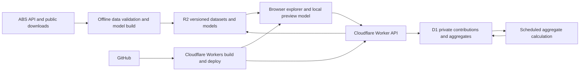

# SeeFish — Australian dating pool explorer

Project plan · 19 September 2026.

## Latest update — 20 September 2026

The current About you page supersedes the common-ground comparison windows below. It uses a large matching-pool count and a linear breakdown of residents → selected ages → full type → unmeasured mutual interest. The similar-age/height/income orb and combined similarity counts are removed. There is no reliable source for a calibrated reciprocal-interest count, so the final stage is explicitly unknown; relevant primary studies and practical local suggestions occupy two adjacent tabs. See `docs/dating-research.md` and `docs/activity-sources.md`.

Own gender, age and ancestry are explicit optional inputs. Women aged 20–24 who select Indian background receive a prominent personal note with a user-initiated Instagram link to @manav141, independent of height/income and never added to population counts. Own details remain in memory. The map coastline only fades in below 2% of the reference pool; click ripples, currents and shimmer respect reduced motion.

## Implementation update — revised product direction

The owner subsequently replaced the original editorial design direction with a compact, single-screen explorer. This supersedes the hero, footer, explainer popups, optional collapsed filters, sharing cards, and saved scenarios below.

Implemented direction: the first release is a two-page journey. Your type keeps all age/height/income/background filters visible on the left; a high-resolution Three.js particle Australia sits on the right; city zoom, cursor displacement, and filter-driven particle thinning make the map reactive. About you uses three optional single-value sliders and shows demographic common ground. There is no separate pool page or reciprocal-interest estimate. One Methodology page contains sources and contribution controls. The header links “Made by Manav” to manavdodia.com. The minimal, featureless fish mark is shared by the logo and favicon. The palette is warm plum night with pearl, lilac, ice, and pale coral particles; low-count pools retain an outlined, magnified map view.

The calculation, provenance, and anonymous preference capture remain in scope. The current release uses the verified 2021 Census snapshot and NHS 2022 height means; it does not claim current population projections. About you measurements stay in browser memory and are never sent to the Worker. Production contribution capture still requires the account-specific D1 binding and migration described in docs/deployment.md.

The original plan follows for modelling and infrastructure context.

## 1. Product direction and confirmed decisions

Build a delightful, Australia-focused experience that answers: **“How many people fit what I’m looking for, and how much might our preferences overlap?”** The experience should invite curiosity, explain unexpected patterns, and make uncertainty understandable.

Confirmed with the project owner:

- First release: heterosexual men and women aged 18+, with a data model that can support broader dating preferences later.
- Automatically collect submitted preferences, without accounts, with clear disclosure before submission.
- Visual direction: playful and polished, with transparent estimates.
- Deploy through the existing GitHub → **Cloudflare Workers** connection.
- Start with free public datasets; restricted or paid data access is a later enhancement.

Working decisions:

- Keep **SeeFish** as a provisional name, taken from the previous repository package. Branding can change without affecting the architecture.
- Start with Australia, all eight greater capital city areas, and state/territory remainders. Add other urban areas once geographic mappings are validated.
- Present annual **personal income before tax**, rather than call all income “salary.” Add a separate salary-only measure later if suitable data supports it.
- No accounts, messaging, individual profile browsing, or introductions in the first release. This is a statistical explorer.
- Prioritise a distinctive visual experience and credible estimates over a large filter catalogue.

Repository context: `plan.md` was empty. The working tree currently marks the previous Next.js app as deleted. Those deletions remain untouched; implementation should treat this as a fresh build unless the owner explicitly asks to reuse the prior code.

## 2. What the numbers mean

Keep three quantities visibly distinct:

| Result | Meaning | Evidence |
| --- | --- | --- |
| People who fit | Estimated resident adults satisfying selected demographic criteria | ABS tables plus documented statistical estimates |
| Common ground | People in the chosen pool close to the user's age, height, or income | The same ABS population model, intersected with clearly stated comparison windows |

Demographic fit does not establish that someone is single, seeking a relationship, heterosexual, reachable, attracted to the user, or likely to date them. Show these distinctions in the result labels, not only in a methodology page.

The first result should say **“About [rounded estimate] people fit these demographics”**, with a model range, geography, population reference date, and evidence label. Avoid exact-looking counts such as 12,437 when the inputs only support an approximate answer.

The second page is descriptive common ground only. It does not infer availability, attraction, or reciprocal interest, and it does not require profile responses from other users.

## 3. Experience: an interactive landscape of possibilities

### Visual concept

A warm, editorial interface: off-white background, deep ink text, coral and sea-glass accents, generous space, large numbers, restrained rounded controls, and a small amount of playful illustration. Avoid pink/blue gender coding and app-like profile cards that suggest these are real people available to contact.

The signature visual is a **living pool of light**. A field of dots gently gathers into an Australia silhouette, then responds to the selected city and criteria. Dots represent scaled population mass, not individual people. The legend updates if the scale changes. Use a simplified geographic silhouette rather than a heavy map SDK.

### Journey

1. **Your type:** all filters are visible at once. The map previews the estimate while the user changes city, ranges, or ancestry.
2. **Submit:** “Find common ground” saves preferences for aggregate research after the clear disclosure. A failed save never blocks the local result.
3. **About you:** optional single-value age, height, and income sliders stay local to the browser. Skip and Clear states are explicit.
4. **Common ground:** cards show the count and share within ±5 years, ±10 cm, and ±25% income (minimum $5,000), plus a combined descriptive count where available.
5. **Methodology:** one header link explains source coverage, assumptions, limitations, and deletion of the anonymous preference contribution.

### Micro-interactions with a purpose

| Interaction | Behaviour and purpose |
| --- | --- |
| Range sliders | Selected area fills under the distribution; handles display values; numeric inputs provide an alternative |
| Changing city | Geography transition and smooth redistribution show that the context changed |
| Selecting a criterion | A short contextual sentence explains an observed or modelled association |
| Undo | One action restores the prior state and visual, encouraging experimentation |
| Result reveal | Brief count transition plus a softly drawn uncertainty band |
| Evidence chip | Opens the specific source, date, assumptions, and fallback used for that result |
| Common-ground reveal | A soft orbital graphic and three cards make each descriptive intersection feel tangible without implying attraction |

Use roughly 150–300 ms transitions for controls. Respect reduced-motion settings, support keyboard and screen-reader use, provide visible focus and adequate contrast, and never rely on animation or colour to explain a number. Avoid announcing every slider tick to assistive technology.

### Insights beyond “change your standards”

Generate insights deterministically from the calculation and its provenance. Example copy below describes templates, not established findings:

- **Your preferences have a geography:** compare absolute count and share of the local population in two cities, keeping all criteria fixed. A larger city may have more people even when its matching share is lower.
- **The combination tells a different story:** show when two criteria overlap more or less than an independence assumption would suggest, only if supported by the model.
- **Where your pool sits:** show the age or income distribution within the selected pool, with the current city as a comparison.
- **What we know best:** identify which parts of the estimate have direct data and which have the largest uncertainty.
- **Your two-way window:** once supported, show where the user’s age preferences overlap with relevant respondents’ stated ranges.
- **A useful surprise:** explain that one selected criterion adds little extra restriction once the other criteria are already applied; do not turn this into a judgement about the user.

Do not produce ethnicity desirability rankings, “dating value” scores, or causal claims about background. Do not recommend changing an immutable personal characteristic. Suppress insights that are unstable across plausible model variants.

## 4. Data strategy: verify coverage before promising precision

ABS has an SDMX-based [Data API](https://www.abs.gov.au/statistics/application-programming-interfaces-apis/data-api-user-guide). Its current base is `https://data.api.abs.gov.au/rest/`. Use metadata discovery to obtain actual dataflow IDs, dimensions, codes, and release versions. Do not guess query keys or assume that every Census cross-tabulation is exposed through the API. ABS warns that API availability and freshness are not guaranteed, so users must receive results from validated local snapshots.

As of this plan, use **2021 Census** detail where needed and newer population benchmarks where compatible. The [2026 Census release plan](https://www.abs.gov.au/statistics/research/2026-census-topics-and-data-release-plan) schedules the first main release for June 2027; do not label existing Census characteristics as 2026 observations.

| Need | Initial source and access | Main limitation / fallback |
| --- | --- | --- |
| Population by location, age, sex | [Regional population by age and sex, 2025](https://www.abs.gov.au/statistics/people/population/regional-population-age-and-sex/2025); public tables/API where available | Align geographic editions and reference dates before combining with Census proportions |
| Joint age × sex × income × geography | 2021 Census community profiles/data packs and available API tables; [GeoPackages](https://www.abs.gov.au/census/find-census-data/geopackages) list relevant tables including G17 | Published tables provide selected combinations, not arbitrary multi-variable joints |
| Ancestry/cultural background | Census ancestry tables and [ANCP definition](https://www.abs.gov.au/census/guide-census-data/census-dictionary/2021/variables-topic/cultural-diversity/ancestry-multi-response-ancp) | Multiple responses overlap; broad ethnicity labels require an explicit mapping |
| Household relationship status | Census [social marital status](https://www.abs.gov.au/census/guide-census-data/census-dictionary/2021/variables-topic/household-and-families/social-marital-status-mdcp) | Living without a co-resident partner does not establish being single or seeking dates |
| Height | [National Health Survey 2022, Table 8](https://www.abs.gov.au/statistics/health/health-conditions-and-risks/national-health-survey/2022) and its [methodology](https://www.abs.gov.au/methodologies/national-health-survey-methodology/2022) | Inspect downloadable tables for actual distribution parameters; a mean alone cannot determine the fraction above a height |
| Orientation and later expansion | [ABS experimental LGBTI+ estimates](https://www.abs.gov.au/statistics/people/people-and-communities/estimates-and-characteristics-lgbti-populations-australia/2022) | Limited geographic/detail coverage and a different age universe; not precise city-level heterosexual dating counts |
| Preference behaviour | Submitted preferences linked to voluntarily provided self-demographics; open research used only where its measured variables fit | Site visitors are self-selected, and stated preference is not observed attraction |
| Later richer joint evidence | [TableBuilder](https://www.abs.gov.au/statistics/microdata-tablebuilder/tablebuilder) and [HILDA](https://melbourneinstitute.unimelb.edu.au/hilda/for-data-users) | Access conditions, registration, possible costs, and publication restrictions must be checked; not launch dependencies |

The first data spike must inspect actual downloadable files and metadata, not just source descriptions. Deliver a coverage register that records source URL, table/dataflow, dimensions, units, geography, population universe, reference date, retrieval date, licence, missingness, and whether the required combination is directly available. Mark unverified cells as unverified.

### Semantic rules that prevent misleading results

**Income:** Census [INCP](https://www.abs.gov.au/census/guide-census-data/census-dictionary/2021/variables-topic/income-and-work/total-personal-income-weekly-incp) measures total personal income in bands, including sources other than wages. Preserve negative, zero, missing, and open-ended top categories. Use the source’s published annual equivalents. If a slider cuts through a band, show that interpolation is modelled. Do not infer the high-income tail from a midpoint. Display the income reference year; any present-dollar conversion is a separate, documented estimate, not an observed update to the distribution.

**Background:** use “Cultural background / ancestry” with a plain explanation of the proxy. Allow multiple selections; OR within a filter and AND across filters. Count each person once when matching any selected ancestry. If overlap tables are unavailable, use bounds or a disclosed overlap model rather than summing ancestry totals. “Australian” ancestry does not mean “White.” Country of birth, ancestry, and identity are separate fields.

**Aboriginal and Torres Strait Islander identity:** keep it distinct from ancestry; ABS explains the difference in its [ancestries guidance](https://www.abs.gov.au/statistics/detailed-methodology-information/information-papers/aboriginal-and-torres-strait-islander-ancestries). Do not infer identity from birthplace or a broad cultural label. Confirm coverage of relevant populations before borrowing survey estimates.

**Sex and gender:** source sex categories and user gender are not interchangeable. Store their definitions separately. Explain the limitations of applying historical sex-based tables to a gender-based dating question; never require users to disclose sex assigned at birth merely to use the explorer.

**Height:** prefer measured Australian evidence. The NHS includes imputed physical measurements and coverage limitations. Do not assign a fixed height adjustment to an ethnic group. Background-specific distributions require suitable evidence; otherwise use the best supported age/sex distribution and explicitly identify the unmodelled relationship.

**Availability:** label Census relationship information as “not living with a partner” when that is what it measures. An “actively seeking” estimate needs an additional, visible assumption or suitable survey evidence. Do not use “never married” as a synonym for single.

**Geography:** “Sydney” means Greater Sydney (GCCSA), with an explanatory boundary view. National totals combine disjoint regions. A city cannot be added to a state remainder that already includes it. Suburb/radius estimates are a later feature requiring appropriate geographic evidence.

## 5. Statistical model: one coherent population, many views

### Improve the proposed filter map

Create a **dependency register** describing which variables have evidence of association, what supports each relationship, and what fallback applies. This is both an internal modelling tool and a source for user explanations.

Do not calculate a result by multiplying separate pairwise adjustment percentages. Knowing every pairwise relationship does not identify all higher-order combinations; ad hoc multipliers can double-count effects and produce different answers depending on filter order.

Instead, construct a versioned joint distribution over demographic cells, calibrated to observed tables. Every count, histogram, comparison, and explanation comes from that same model. Relationships are statistical associations, not claims that a demographic characteristic causes another.

### Initial dependency register

| Relationship | Preferred evidence | Initial fallback |
| --- | --- | --- |
| Geography ↔ age/sex | Regional population tables | Broader compatible geographic level |
| Income ↔ age/sex/geography | Census joint tables | Coarser age/income/geographic cells |
| Background ↔ geography/age | Published Census cross-tabs where available | Calibrated margins with declared missing interactions |
| Background ↔ income | A suitable observed joint table | Unidentified interaction scenarios; no invented group multiplier |
| Height ↔ age/sex | Australian measured survey distribution | Pooled adult distribution with wider uncertainty |
| Height ↔ background/income | Suitable open Australian joint evidence, if found | Conditional independence in the baseline, plus sensitivity analysis |
| Availability ↔ age/location | Compatible relationship/survey tables | Clearly labelled broader proxy |
| Preferences ↔ own demographics | Relevant paired submissions | Broader cohorts, then research-supported priors or explicit hypothetical scenarios |

### Implementation sequence

1. Start from directly observed, compatible joint tables, retaining known population universes and unknown categories.
2. Harmonise geography and category definitions. Reconcile Census counts with resident-population benchmarks rather than treating the two as identical universes.
3. Fit a constrained contingency-table model using iterative proportional fitting / maximum entropy against available margins. Use observed interactions in the seed. This supplies a baseline assumption for missing interactions, not evidence that those interactions are known.
4. Preserve structural zeros and distinguish them from perturbed/suppressed cells. Handle inconsistent published margins within justified tolerances; do not force contradictory tables to match exactly.
5. Add conditional continuous distributions for height and any within-income-band interpolation. Fit parameters only from adequate evidence; otherwise restrict controls to supported bands or present explicit sensitivity scenarios.
6. Reweight compatible age/sex/geography cells to newer population benchmarks. Hold unsupported historical relationships constant only as a labelled projection assumption, with sensitivity ranges.
7. Produce a compact, deterministic model artifact for the browser/API. Train and calibrate offline; avoid heavy model fitting inside request handlers.
8. Evaluate alternative plausible assumptions for unidentified interactions and temporal drift. Retain a reproducible model ensemble for uncertainty and insight stability checks.

For a chosen pool with weighted cells `w_i` and criteria `F`:

```text
N_fit(F) = sum_i w_i × P(F satisfied | cell i)

N_available(F) = sum_i w_i × P(F satisfied AND available | cell i)
```

Integrate height/income ranges within cells instead of randomly sampling a new synthetic population on each request. Only factor joint events into separate probabilities when the model explicitly assumes conditional independence.

For each filter’s distribution chart, condition on **all other active filters** and temporarily exclude that filter’s own constraint. This shows the choices still available rather than a histogram already truncated to the current selection.

### Uncertainty and reliability

- Separate source sampling error, Census confidentiality perturbation, missing-data assumptions, uncertain dependencies, and historical projection uncertainty.
- Carry source survey error where available. Do not manufacture sampling precision for reconstructed Census combinations.
- Display an “estimated range” across defensible model variants. Only call an interval a 95% confidence/credible interval when a calibrated procedure justifies that label.
- Use per-result evidence states: **direct table**, **modelled combination**, **limited evidence**, or **illustrative scenario**. A combination of good marginal sources is not automatically high confidence.
- Sparse/unsupported combinations may produce a broad bound or “too little evidence for a useful estimate.” Never silently turn unknown into zero.
- Show rounded central estimates only where informative; very small estimates should display a range such as “fewer than 100,” with no implication of exactly zero people.

## 6. Common ground: a descriptive comparison

ABS cannot supply a population-wide map of who wants to date whom, so SeeFish does not claim to estimate that. The About you page instead compares the user's supplied measurements with the selected pool using transparent product windows.

Let `F` describe the selected criteria and `W(x)` a comparison window around one local measurement:

```text
N_common(F, x) = count(F ∩ W(x))
```

The calculation uses the same joint Census model as the main estimate. It is a demographic intersection, not an attraction probability.

### Evidence and limits

1. Age and height windows can use the model directly; income similarity excludes the open-ended `$182,000+` band rather than pretending its lower edge is exact.
2. Missing measurements show an unavailable card, not zero.
3. The user's gender, city, and ancestry are retained locally for context and do not become unsupported desirability multipliers.
4. Rounded estimates and model ranges remain visible. No site-wide acceptance percentage is applied to a selected pool.

The result label says **“demographic common ground”** and the methodology copy says that it does not measure availability or attraction.

### Initial release rules

- Keep the three comparison windows fixed and visible in the interface.
- Store only the submitted preferences; About you measurements never leave the browser.
- Never label common ground as interest, availability, or compatibility.

## 7. Submission capture and privacy

### Behaviour requested by the owner

Automatically save preferences **on submit**, with a prominent explanation immediately before the action. Browsing and slider movement do not create research records. No account is required.

Suggested stage-one disclosure, to refine against the actual implementation:

> By selecting “Reveal my pool,” you agree to save these preferences for aggregate research that improves the estimates. No name or email is collected. Your answers are not published individually. Learn how data is used.

Stage two needs a separate disclosure because it adds personal demographics and links them to preferences. Record the disclosure version and affirmative submission action. A buried privacy-policy link is insufficient context. OAIC identifies racial/ethnic origin and sexual orientation as [sensitive information](https://www.oaic.gov.au/privacy/your-privacy-rights/your-personal-information/what-is-personal-information); its [APP 3 guidance](https://www.oaic.gov.au/privacy/australian-privacy-principles/australian-privacy-principles-guidelines/chapter-3-app-3-collection-of-solicited-personal-information) informs the collection design. Review the precise consent mechanism and applicable obligations before launch.

“Anonymous” should mean no public identity or account, not a promise that a rare combination is mathematically unidentifiable. Linked contributions with a deletion capability are best treated internally as pseudonymous until sufficiently aggregated.

### Data minimisation and integrity

- Store structured categories and coarse location, not names, emails, exact birth dates, addresses, free-text biographies, or precise GPS coordinates.
- Use a random first-party contribution token to link the two stages, allow edits, and deduplicate repeated submissions within that browser. Store a hash of the secret capability server-side; do not expose public lookup IDs as authentication.
- Maintain one active research contribution per token, replacing preferences on resubmission. Keep aggregate counts of revisions separately only if useful and disclosed.
- Provide “Delete my contribution” and a recovery/deletion code. Explain that clearing the browser and losing the code removes the ability to identify that contribution later.
- Proposed retention: active row-level contributions expire after 12 months; use a shorter recent window for preference estimates and retain only sufficiently aggregated statistics longer. Define backup expiry and deletion propagation before launch.
- No raw request bodies, preference values, or self-demographics in logs, URLs, analytics events, error reports, or shared links.
- Use rate limits, origin checks, payload validation, and adaptive bot challenges. Keep any short-lived network-level abuse signals separate from research data; do not create persistent device fingerprints.
- Suppress small cohort outputs, coarsen query dimensions, and restrict repeated differencing queries so users cannot reconstruct individual contributions from nearby results.
- Preview deployments use separate stores and synthetic contributions. Production data never enters development fixtures.
- Population datasets and community contributions remain separate. Community self-reports must not silently overwrite ABS demographic distributions.

Cloudflare infrastructure may process data outside Australia. D1 offers location hints, including Oceania, but [location hints are not residency guarantees](https://developers.cloudflare.com/d1/configuration/data-location/). Describe actual processing accurately; do not promise Australia-only storage on this architecture.

## 8. Cloudflare architecture

Recommended initial stack: **React + TypeScript + Vite**, with static assets and a small TypeScript API on Cloudflare Workers. A primarily interactive explorer does not need a server-rendered framework for its core flow. Use SVG/CSS for visualisations first and Canvas only if profiling justifies it. Use an accessible component foundation and a small motion layer.

The existing repository history used Next.js, but preserving that framework is not a requirement. If implementation reuses it, verify the current [Cloudflare Next.js deployment guide](https://developers.cloudflare.com/workers/framework-guides/web-apps/nextjs/) and runtime compatibility before selecting an adapter.



| Component | Responsibility |
| --- | --- |
| Browser | Local interaction state, conditional charts, preview calculations, accessible experience |
| Worker API | Validate requests, return canonical versioned calculations, record disclosed preference submissions |
| D1 | Contributions, consent/disclosure metadata, deletion capabilities |
| R2 | Source snapshots, manifests, compact public model artifacts, validation reports |
| Offline pipeline | Download, harmonise, fit, validate, and version models; Python is suitable for this work |
| Scheduled job | Check source freshness and rebuild contribution aggregates; heavy fitting remains offline/CI |
| GitHub + Workers Builds | Preview builds, checks, production deployment through the existing integration |

Cloudflare documents repository-triggered builds in [Workers Builds](https://developers.cloudflare.com/workers/ci-cd/builds/). Inspect existing build/deploy commands and bindings before implementation; a connected repository alone does not configure databases, secrets, or migrations.

### API outline

| Endpoint | Contract |
| --- | --- |
| `GET /api/model-manifest` | Current model/data versions, references, geography definitions, evidence coverage |
| `POST /api/calculate` | Stateless estimate for normalised criteria; no research contribution is created |
| `POST /api/submissions` | Explicit submit action: validate disclosure acknowledgement, idempotently store/update preferences, return result and private capability |
| `DELETE /api/contribution` | Verify secret capability, remove linked rows, schedule aggregate recomputation |

Shared calculation responses include `estimate`, `range`, `rangeMeaning`, `denominator`, `geography`, `referencePeriods`, `evidenceState`, `assumptions`, `sourceIds`, `modelVersion`, and `insights`. Invalid/missing fields receive structured errors.

Use idempotency keys and transactions for saves. A save failure must not claim the contribution was recorded; still allow the user to see their locally calculated result with an accurate status. Never retry by creating duplicate records. If a client uses an old model version, return an explicit refresh/version state.

### Operational choices

- No live ABS call on the critical user path. Use last-known-good snapshots during source outages and display their dates.
- Cache public model artifacts by version. Treat submitted and reciprocal results as private; do not put them in a shared response cache or query-string cache key.
- Model updates must pass validation before promotion. Roll back by changing the active manifest, retaining immutable prior artifacts.
- Use separate preview/production databases and buckets, additive database migrations, least-privilege secrets, and error reporting with redaction.
- Track payload size, Worker CPU, D1 reads/writes, R2 storage/requests, and job duration. Set usage alerts and measure realistic traffic before committing to a monthly cost estimate.
- Keep the first architecture small; add Queues, Durable Objects, or another datastore only for a measured need.

## 9. Delivery plan and acceptance gates

Indicative effort is 5–8 weeks for one experienced developer, including data investigation and design refinement. This is a planning range, not a commitment; the data audit determines which estimates can responsibly ship.

| Phase | Deliverables | Exit condition |
| --- | --- | --- |
| 0. Data and deployment spike — 3–5 days | Inspect real ABS tables/API metadata; build coverage/dependency register; verify Workers settings; identify all unsupported joints | One reproducible city × age × sex × income calculation, height coverage decision, and explicit fallback for every launch filter |
| 1. Interaction prototype — 4–6 days | Visual direction, complete two-step flow, pool animation, distribution controls, result/uncertainty cards | Mobile and desktop walkthrough with clearly labelled fixture data; keyboard/reduced-motion path works |
| 2. Population model — 7–10 days | Source ingestion, geographic harmonisation, calibrated joint model, uncertainty variants, model artifacts, calculation API | Benchmark comparisons and mathematical invariants pass; no unexplained hardcoded demographic multipliers |
| 3. Live explorer and collection — 5–7 days | Real-data UI, disclosure and idempotent capture, D1 schema, deletion flow, personalised insights | Complete first-stage flow on a Workers preview with no sensitive payloads in logs |
| 4. About you and common ground — 2–4 days | Local single-value sliders, descriptive intersection cards, sparse/unknown states | No profile payload leaves the browser; thresholds and unsupported income tail are explicit |
| 5. Beta and launch — 4–6 days | Accessibility/performance work, browser testing, source/methodology pages, privacy review, operational checks | Acceptance checks pass; fresh users understand demographic fit versus common ground and data capture |

Research-access applications, custom ABS tables, broader orientation coverage, and radius search are later work, not hidden dependencies for this schedule.

### Launch scope

Ship geography, desired partner gender within the initial scope, age, personal income, height, and ancestry/background with coverage-aware fallbacks. Include local common-ground comparisons, conditional distributions, three strong insight templates, source drawers, and one city comparison.

Defer education, smoking, children, religion, relationship intentions, commute-radius matching, accounts, and richer demographic modelling until the core is validated. Each additional filter requires a data-coverage assessment and an accessible local comparison story.

## 10. Validation and success measures

### Statistical correctness

- Unfiltered totals reconcile to their specified population benchmark; age 18+ is enforced consistently.
- Tightening a hard filter never increases the result under the same model. “No preference” restores the appropriate total. Filter order never changes the result.
- Selecting overlapping ancestry categories does not count anyone twice. Changing geography does not mix boundary editions or overlapping areas.
- Counts remain between zero and the eligible population. Common-ground counts never exceed the selected pool.
- Validate against published cross-tabs not used for fitting where possible. Report error by cohort, not just a national average, and set tolerances before evaluating held-out results.
- Check income boundaries, top coding, zero/negative/missing income, partial age bands, survey coverage, and all supported geographic mappings.
- Test sensitivity to unobserved dependencies and demonstrate that unsupported precision does not appear in UI copy.
- Cross-check browser previews and canonical server calculations against identical versioned fixtures.

### Collection and common-ground correctness

- A slider change creates no contribution; a disclosed submit creates exactly one active contribution; retry/update does not inflate the sample.
- About you measurements remain local and are never included in the preference contribution payload.
- Common ground evaluates each supplied measurement against the selected target cohort, handles missing fields as unavailable, and excludes the open-ended top income band from false precision.
- Deduplication, expiry, deletion, and contribution rebuild behaviour have meaningful tests.
- Security checks cover injection, unauthorised profile attachment/deletion, shared-cache leakage, and inference through repeated cohort queries.

### Experience and operation

- Playwright covers explore → submit → About you → common-ground cards, including failures, empty evidence, and small pools.
- Test keyboard navigation, screen-reader labels, contrast, reduced motion, mobile Safari, and common desktop browsers.
- Targets to measure on an agreed mid-range mobile device/network: LCP under 2.5 seconds, INP under 200 ms, local visual feedback under 100 ms, and cached API calculations under 500 ms at p95.
- Confirm preview isolation, source-outage fallback, model rollback, migrations, and log redaction in the Workers runtime.

### Product measures

Measure completion of the first result, completion of About you, source-methodology use, and user comprehension in short usability sessions. Collect aggregate event names rather than demographic payloads. Also monitor freshness, failure rate, and model-range width.

The experience succeeds when users find it engaging **and** can explain the difference between demographic fit and descriptive common ground. A dramatic number that users misunderstand is a product failure.

## 11. Remaining implementation decisions

All initial scope questions have been answered. Proceed using this plan; resolve these bounded details during the data/design spike:

1. Final name and brand treatment; SeeFish is provisional.
2. Exact free-table coverage for ancestry × income and height distributions, including overlap data and licence terms.
3. Existing Workers build configuration, domain, and binding setup.
4. Final retention, disclosure wording, and uncertainty thresholds after privacy and statistical review.
5. Final retention, consent wording, small-cohort rules, and uncertainty thresholds after privacy and statistical review.

The first concrete implementation milestone is a working visual prototype backed by one verified city/age/sex/income slice, with the complete two-page journey and honest placeholders for unverified estimates. Expand the model and evidence coverage before replacing those placeholders with production numbers.
